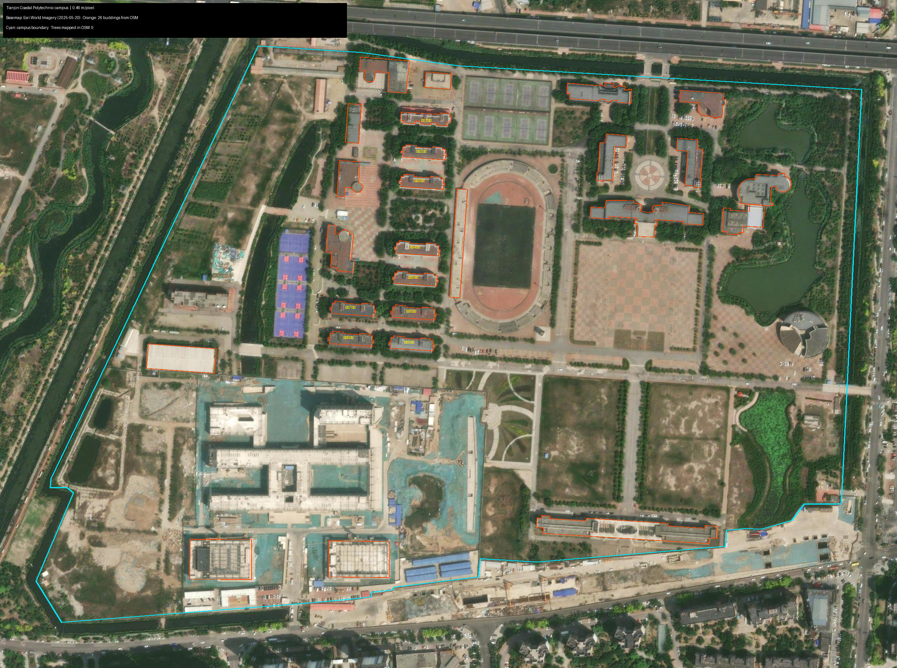

# 校园树木地图 · 天津滨海职业学院

把校园地图做成一个能点、能加、能实时协作的记录工具。
学生带着手机在校园里边走边记树木，老师在电脑上看着标记一个个冒出来。

**老校区纪念版** —— 学校正在建新校区（黄港，2027 年竣工），
这个项目把老校区的树记录下来留个念想。



---

## 这个项目解决什么问题

学校要做校园树木的信息化，但**公开数据里一棵树都没有**。
查了 OpenStreetMap，整个校园的树木记录数是 **0** —— 树的信息只能靠人一棵棵录。

所以做了这个工具：在地图上点一下就能记一棵树（位置、树种、数量、照片），
几十个学生分头记录，数据实时汇总到老师电脑上，不用收文件再手工合并。

---

## 两种用法

### 最省事：双击打开

`dist/` 目录里有打包好的应用（不在版本库里，用下面命令生成）：

```bash
sh launcher/build.sh      # 需要 Go 工具链
```

生成的压缩包解压后**双击就能用，不需要装 Python**：

| 文件 | 平台 |
|---|---|
| `校园树木地图-macOS.zip` | Mac（Apple Silicon 和 Intel 都支持） |
| `校园树木地图-Windows.zip` | Windows |

打开后页面底部会显示该发给学生的地址，点一下就能复制：

```
🟢 实时协作中 · 点地图添加第一棵树 · 📱 http://192.168.1.103:8080/
```

### 开发者：直接跑

```bash
python3 web/server.py
```

效果一样，只是电脑上得有 Python。

---

## 功能

**平面地图** —— 卫星影像 + 建筑轮廓，看得清地面细节，适合实地记录

**三维视图** —— 26 栋楼按真实层数立起来，可旋转倾斜；适合汇报展示
- 🔄 环绕：相机自动绕校园转一圈，投大屏时不用手拖
- 🔍 筛选：按树种筛选，没选中的变暗保留（不直接隐藏，避免误以为那片没记录）

**实时协作** —— 谁记了什么，其他人几秒内自动看到，不用刷新页面

**多人合并** —— 两个人记了同一棵树，系统按 GPS 距离自动识别并提示，
由人来决定是合并、都保留还是丢弃

**导出** —— CSV 交给老师（Excel 打开不乱码）、JSON 备份（含照片）

---

## 关于底图的一个说明

底图用的是 Esri 卫星影像，拍摄日期 **2025-05-20**。

有人会问为什么不用更新的。核实过：**这是这块地能拿到的最新影像**。
把当前版本和 Esri 的历史版本存档逐像素比对，2026 年的三次更新
在这块地都是同一张图（像素差为 0.00）。

国内地图源（如高德）的影像确实更近，但那张是落叶季拍的，
**树上看不见树冠** —— 对一个"数树"的项目来说，这个代价太大。

详见 `analysis/scripts/README.md` 里的核实记录。

---

## 目录结构

```
web/                  网页应用
├── index.html
├── app.js            平面视图 + 数据管理
├── view3d.js         三维视图（MapLibre GL）
├── server.py         协作服务器（只用 Python 标准库）
├── campus.json       校园矢量数据（26 栋建筑，带估算高度）
├── species.json      树种库（31 个天津本地常见种）
├── tiles/            离线地图瓦片（486 张，保证没网也能用）
└── vendor/           Leaflet + MapLibre GL

launcher/             一键启动器
├── main.go           Go 写的服务（把整个网页打包进单个可执行文件）
├── build.sh          一次生成 macOS 和 Windows 两个版本
└── accept.sh         自动验收脚本

analysis/scripts/     数据获取与分析
├── fetch_osm_campus.py     从 OpenStreetMap 拉校园矢量数据
├── build_campus_3d.py      生成建筑高度估算和底图
└── build_web_assets.py     生成网页用的数据文件

data/raw/osm/         原始数据（校园边界、建筑、道路、水体）
data/processed/       处理后数据（带高度的建筑体块）

figures/              成果图
results/reports/      可行性调研报告
```

---

## 技术选型说明

**为什么用 Go 写启动器**：Python 的打包工具必须在 Windows 上才能生成
Windows 程序，而 Go 可以直接在 Mac 上交叉编译。一次生成两个平台。

**为什么地图瓦片要放在本地**：学生在校园里用，不能假设有稳定网络。
整个应用零外部依赖。

**为什么两个渲染库并存**：Leaflet 做平面（轻快、手机上跟手），
MapLibre GL 做三维（WebGL 渲染建筑体块）。两者共用同一份数据。

**踩过的坑**（详见 `web/使用说明.md`）：
- 三维视图不能用 symbol 文字图层 —— 它要加载远程字体，字体拉不到时
  会连带把整个数据源的渲染卡住
- 建筑高度是估算的。OSM 里没有真实高度数据，按楼层数推算，
  每栋都标注了推算依据

---

## 数据来源与许可

| 内容 | 来源 | 许可 |
|---|---|---|
| 卫星底图 | Esri World Imagery（2025-05-20，0.34 m/px） | 仅供本项目评估使用 |
| 建筑轮廓 | OpenStreetMap | ODbL 1.0，使用时需署名 |
| 树种库 | 参考《天津市适宜园林树木栽植导则》 | — |
| 树木数据 | 师生实地记录 | — |

**坐标系**：项目内部统一用 WGS-84。如果要接入高德/百度底图，
必须做坐标转换（GCJ-02 偏移约 90 米），否则树会跑到马路对面。

---

## 版本

- **v1.0** —— 首个完整版本：平面地图、三维视图、实时协作、
  多人合并、一键启动器（macOS + Windows）

### 发新版本

改完代码后，一条命令：

```bash
sh release.sh v1.1 "修复了三维视图的显示问题"
```

它会自动：提交改动 → 打标签 → 推送代码和标签 → 提示建 Release。

版本号用 `v主.次` 的格式：加了新功能升次版号（v1.1、v1.2），
大改动升主版号（v2.0）。

Release 说明会自动从提交记录汇总，所以**提交信息写清楚一点**，
Release 页面就好看。

---

## 关于

天津滨海职业学院（Tianjin Coastal Polytechnic）老校区树木记录项目。

校园约 53.7 公顷（805 亩），26 栋建筑，建筑密度 8.3%。
按一般高校绿地密度估算，乔木可能 2000～5000 株。
